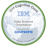
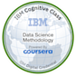
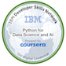
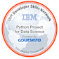
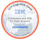
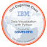

  

The program consists of 9 online courses that includes open source tools and libraries. It touches on, Python, databases, SQL, data visualisation, data analysis, statistical analysis, predictive modelling, and machine learning algorithms.

<<<<<<< HEAD
This repository consists of all the lab and projects done to acquire the IBM Data Science Professional Certificate.

Please click on the individual badges to verify.
=======
This repository consists of all the lab and projects done to acquire the IBM Data Science Professional Certificate
>>>>>>> e5e875d7ab69706099973fa850883a678ae109db

# Courses

1. What is Data Science?

This is an overview on the field of Data Science and there were no lab or project work done.

  

2. [Tools for Data Science](https://github.com/JoelTanSG/IBM-Data-Science-Specialization/tree/16bd6c5d873c0e231d018986f432aae97d1c00b4/Tools%20for%20Data%20Science)

Touched on the different tools used Jupyter Notebooks, JupyterLab, RStudio IDE, Git, GitHub, and Watson Studio. The programming languages they can execute, their features and limitations.

  

3. [Data Science Methodology](https://github.com/JoelTanSG/IBM-Data-Science-Specialization/tree/main/Data%20Science%20Methodology)

In this course, the subjects are:
    - The major steps involved in tackling a data science problem.
    - The major steps involved in practicing data science, from forming a concrete business or research problem, to collecting and analyzing data, to building a model, and understanding the feedback after model deployment.
    - How data scientists think!

  

<<<<<<< HEAD
4. [Python for Data Science, AI & Development](https://github.com/JoelTanSG/IBM-Data-Science-Specialization/tree/main/Python%20for%20Data%20Science%2C%20AI%20%26%20Development)
=======
4. [Python for Data Science, AI & Development]()
>>>>>>> e5e875d7ab69706099973fa850883a678ae109db

Learn Python fundamentals, including data structures and data analysis, complete hands-on exercises throughout the course modules.

  

<<<<<<< HEAD
5. [Python Project for Data Science](https://github.com/JoelTanSG/IBM-Data-Science-Specialization/tree/main/Python%20Project%20for%20Data%20Science)
=======
5. [Python Project for Data Science]()
>>>>>>> e5e875d7ab69706099973fa850883a678ae109db

This mini-course is intended to demonstrate foundational Python skills for working with data. The completion of this course involves working on a hands-on project where a simple dashboard using Python is developed.

  

<<<<<<< HEAD
6. [Databases and SQL for Data Science with Python](https://github.com/JoelTanSG/IBM-Data-Science-Specialization/tree/main/Databases%20and%20SQL%20for%20Data%20Science%20with%20Python)
=======
6. [Databases and SQL for Data Science with Python]()
>>>>>>> e5e875d7ab69706099973fa850883a678ae109db

The purpose of this course is to introduce relational database concepts and help you learn and apply foundational knowledge of the SQL language. It is also intended to get you started with performing SQL access in a data science environment.  

The emphasis in this course is on hands-on and practical learning . As such, you will work with real databases, real data science tools, and real-world datasets. You will create a database instance in the cloud. Through a series of hands-on labs you will practice building and running SQL queries. You will also learn how to access databases from Jupyter notebooks using SQL and Python.

  

7. [Data Visualization with Python](https://github.com/JoelTanSG/IBM-Data-Science-Specialization/tree/main/Data%20Visualization%20with%20Python)

The main goal of this Data Visualization with Python course is to teach you how to take data that at first glance has little meaning and present that data in a form that makes sense to people. Various techniques have been developed for presenting data visually but in this course, we will be using several data visualization libraries in Python, namely Matplotlib, Seaborn, and Folium.

  

<<<<<<< HEAD

8. [Machine Learning with Python]()

This course dives into the basics of machine learning using an approachable, and well-known programming language, Python.
In this course, we will be reviewing two main components:
First, you will be learning about the purpose of Machine Learning and where it applies to the real world.
Second, you will get a general overview of Machine Learning topics such as supervised vs unsupervised learning,  model evaluation, and Machine Learning algorithms.

  

9. [Applied Data Science Capstone]()

This capstone project course will give you a taste of what data scientists go through in real life when working with real datasets. You will assume the role of a Data Scientist working for a startup intending to compete with SpaceX, and in the process follow the Data Science methodology involving data collection, data wrangling, exploratory data analysis, data visualization, model development, model evaluation, and reporting your results to stakeholders.   

You are tasked with predicting if the first stage of the SpaceX Falcon 9 rocket will land successfully.  SpaceX advertises Falcon 9 rocket launches on its website, with a cost of 62 million dollars; other providers cost upward of 165 million dollars each, much of the savings is because SpaceX can reuse the first stage.

Therefore if you can accurately predict the likelihood of the first stage rocket landing successfully, you can determine the cost of a launch. With the help of your Data Science findings and models, the competing startup you have been hired by can make more informed bids against SpaceX for a rocket launch.

  

=======
>>>>>>> e5e875d7ab69706099973fa850883a678ae109db
